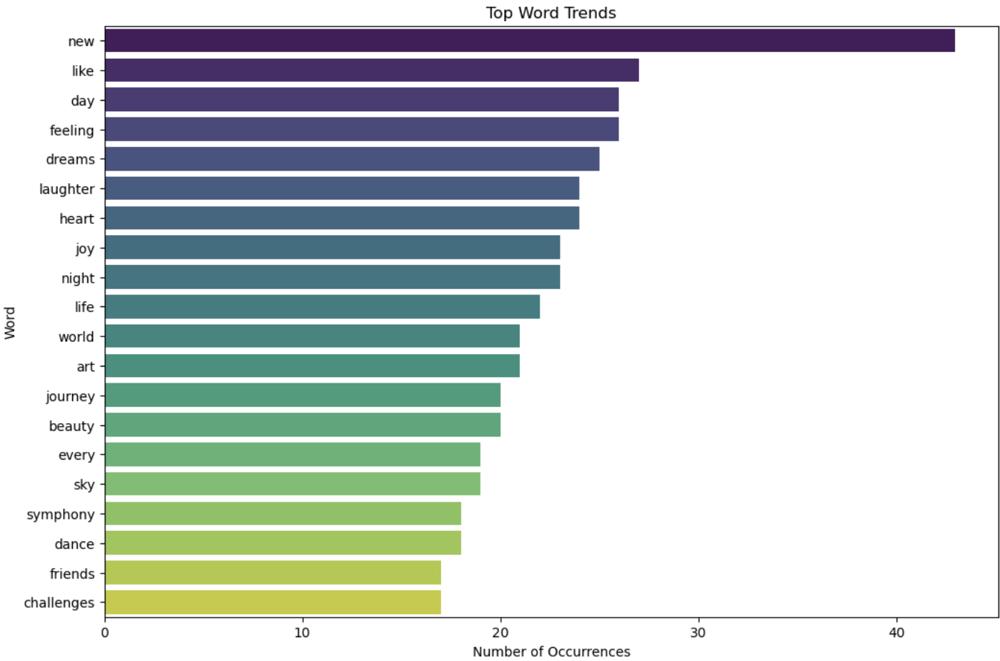
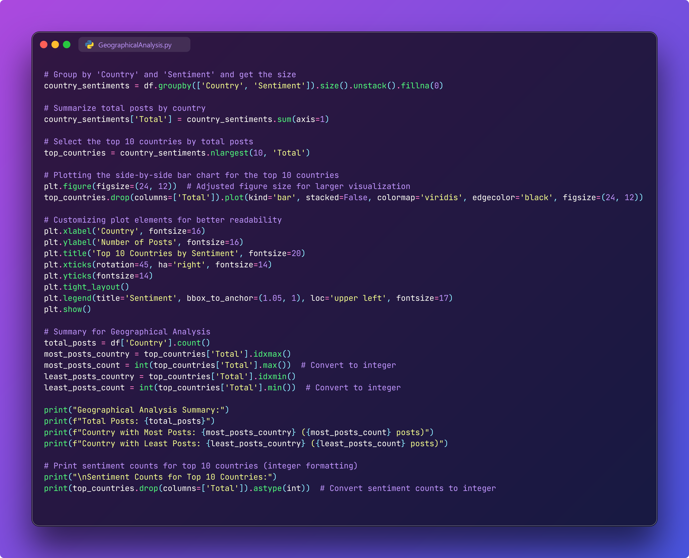

# Social Media Sentiment Analysis


## Introduction
In this project, will perform detailed sentiment analysis on social media data to understand the overall sentiment of user-generated content. By analyzing the sentiment expressed in various posts, it is possible to gain insights into public opinion, user engagement, and content trends across different platforms.

## Problem Statement
The main objective of this project is to analyze user-generated content from social media to:
- Determine the distribution of sentiments (positive, neutral, negative).
- Understand temporal trends in user sentiments.
- Analyze user engagement patterns.
- Perform platform-specific sentiment analysis.
- Conduct geographical sentiment analysis.

The goal of this project is to analyze the sentiments of social media posts to identify the distribution of positive, neutral, and negative sentiments over time and across different platforms. This analysis will help in understanding user behavior, engagement levels, and trends in public sentiment.

## Skills Demonstrated
- **Python Programming**: Writing and executing scripts for data processing and analysis.
- **Data Cleaning and Preprocessing**: Handling missing values, removing noise, and preparing data for analysis.
- **Sentiment Analysis**: Using the VADER sentiment analysis tool to classify sentiments of text data.
- **Data Visualization**: Creating insightful visualizations using Matplotlib and Seaborn.
- **Exploratory Data Analysis (EDA)**: Analyzing data distributions, correlations, and trends.
- **Natural Language Processing (NLP)**: Techniques for processing and analyzing text data, including tokenization, stopword removal, and sentiment scoring.

## Data Sourcing
The dataset used in this project is sourced from [Kaggle](https://www.kaggle.com/datasets/kashishparmar02/social-media-sentiments-analysis-dataset), specifically the Social Media Sentiments Analysis Dataset. This dataset includes user-generated content from various social media platforms, along with associated metadata such as timestamp, user information, and engagement metrics (likes and retweets).

## Data Transformation
1. **Data Cleaning**: Removing leading and trailing spaces from columns, handling missing values, and normalizing text data.

- Package Installation & Import Library


- Code Explanation
  - Package Installation
    - 'pip install wordcloud' : Installs the wordcloud library to create word cloud visualizations that show the most frequently occurring words in text.
    - 'pip install nltk' : Installs the nltk (Natural Language Toolkit) library for natural language processing, including stop words and tokenizer.
    - 'pip install vaderSentiment' : Installs the vaderSentiment library used for text sentiment analysis.
  - Import Library
    - import numpy as np: Imports the numpy library used for numerical operations.
    - import pandas as pd: Imports the pandas library used for data manipulation in DataFrame form.
    - from colorama import Fore, Style: Imports the colorama library to give color to the text in the console, facilitating visualization of the results.
    - import nltk: Imports the nltk library for natural language processing.
    - from nltk.corpus import stopwords: Imports a list of stop words from nltk to remove meaningless common words in text analysis.
    - from nltk.sentiment import SentimentIntensityAnalyzer: Imports the sentiment analyzer from nltk for text sentiment analysis.
    - from vaderSentiment.vaderSentiment import SentimentIntensityAnalyzer as VaderSA: Imports a sentiment analyzer from the vaderSentiment library that is also used for text sentiment analysis.
    - from wordcloud import WordCloud: Imports WordCloud to create a word cloud visualization.
    - import matplotlib.pyplot as plt: Import matplotlib for data visualization.
    - import seaborn as sns: Import seaborn for more interesting and informative data visualization.
    - from collections import Counter: Imports Counter from the collections library to count the occurrences of elements in a list or array.
    - import re: Imports the re library for regex (regular expressions) operations, which are used for text manipulation.
  - Downloading Stop Words
    - nltk.download('stopwords'): Downloads a list of stop words from nltk. Stop words are common words that appear frequently in text but have no important value for analysis, such as “and”, “the”, “is”, and so on. Removing stop words can help in cleaning up the text for more accurate analysis.

- Usefulness on Projects
  - In the sentiment analysis project, these libraries and functions were used for various purposes:
    - Data Manipulation and Analysis:
      - numpy and pandas were used for data manipulation and analysis.
      - collections.Counter was used to count the frequency of words or elements in the data.
    - Natural Language Processing:
      - nltk and vaderSentiment are used for sentiment analysis. SentimentIntensityAnalyzer of these two libraries helps in determining the sentiment (positive, negative, neutral) of the text.
      - nltk's stopwords are used to remove common unimportant words from the text.
    - Data Visualization:
      - matplotlib and seaborn are used to create various types of data visualizations such as bar graphs, pie charts, and others.
      - wordcloud is used to create word cloud visualizations that show the most frequently occurring words in text.
    - Text Cleanup:
      - re used for text manipulation using regular expressions, such as removing punctuation marks, symbols, or specific words from text.
    - Color Visualization on the Console:
      - colorama is used to give color to the text output on the console, making it easier to read and understand the analysis results.
- Usage Example
  - Calculating Sentiment with VADER:
     - Using the analyzer of vaderSentiment to calculate the sentiment score of the cleaned text (Cleaned_Text).
     - Determine the sentiment category (positive, negative, neutral) based on the sentiment score.


```python
analyzer = SentimentIntensityAnalyzer()
df['Vader_Score'] = df['Cleaned_Text'].apply(lambda text: analyzer.polarity_scores(text)['compound'])
df['Sentiment'] = df['Vader_Score'].apply(lambda score: 'positive' if score >= 0.05 else ('negative' if score <= -0.05 else 'neutral'))
```

  - Word Cloud Visualization:
     
    - Create a word cloud visualization of the cleaned text, showing the most frequently occurring words.


```python
wordcloud = WordCloud(stopwords=stopwords.words('english'), background_color='white', width=800, height=400).generate(' '.join(df['Cleaned_Text']))
plt.figure(figsize=(10, 5))
plt.imshow(wordcloud, interpolation='bilinear')
plt.axis('off')
plt.show()

```


- Data Cleaning


## Modeling
The modeling process involves:
1. **Sentiment Scoring**: Using VADER to score each post and classify it into positive, neutral, or negative categories.


## Analyze & Visualization
The analysis includes:
1. **Sentiment Distribution**: A donut chart showing the overall distribution of positive, neutral, and negative sentiments.

| Python Code | Result |
|----------|----------|
|  |  |
3. **Temporal Analysis**:
   - Year-wise sentiment distribution: Bar charts showing the number of posts per year categorized by sentiment.
     | Python Code | Result |
     |----------|----------|
     |  |  |
   - Month-wise sentiment distribution: Bar charts showing the number of posts per month categorized by sentiment.
     | Python Code | Result |
     |----------|----------|
     |  |  |
   - Day of the week sentiment distribution: Bar charts showing the number of posts per day of the week categorized by sentiment.
     | Python Code | Result |
     |----------|----------|
     |  |  |
4. **User Behavior Insights**: Analyzing user engagement metrics such as likes and retweets to identify the most engaging content and active users.
   - User Engagement : Scatter Plot.
     | Python Code | Result |
     |----------|----------|
     |  |  |
   - Top 10 User By Like : Bar Chart.
     | Python Code | Result |
     |----------|----------|
     |  |  |
   - Top 10 User by Retweets : Bar Chart.
     | Python Code | Result |
     |----------|----------|
     |  |  |
   - Yearly Engagement Summary : Bar Chart.
     | Python Code | Result |
     |----------|----------|
     |  |  |
5. **Platform-Specific Analysis**: Comparing sentiment distributions across different social media platforms.
     | Python Code | Result |
     |----------|----------|
     |  |  |
6. **Hashtag Trends**: Identifying the most frequently used hashtags and common words in the dataset.
   - Top Hastag : Bar Chart & Generate WordCloud
     | Python Code | Result |
     |----------|----------|
     |  |  |

     | Python Code | Result |
     |----------|----------|
     |  |  |

   - Top Common Word : Bar Chart & Generate WordCloud
     | Python Code | Result |
     |----------|----------|
     |  |  |

     | Python Code | Result |
     |----------|----------|
     |  |  |

7. **Geographical Analysis**: Analyzing sentiment distribution across different countries.
     | Python Code | Result |
     |----------|----------|
     |  |  |

You can see the report here [Google Colab]()

## Conclusion & Recommendations
This sentiment analysis provides valuable insights into public opinion and engagement across social media platforms. Key findings include:
- A higher proportion of positive sentiments compared to negative and neutral ones.
- Variation in sentiment distribution over time, with certain years and months showing more activity.
- Significant user engagement metrics indicating popular content and active users.
- Differences in sentiment trends across platforms and geographical regions.

**Recommendations**:
- Use these insights to tailor marketing strategies and content creation to match audience sentiment and engagement patterns.
- Monitor sentiment trends to quickly respond to negative sentiments and capitalize on positive feedback.
- Leverage platform-specific insights to optimize social media strategies for each platform.
